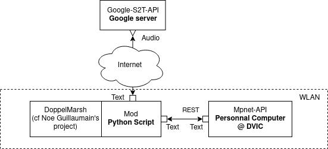

# IAssistant
An assistant for the doppelmarsh DVIC Project

There are 4 parts to this repo and an image to show how it works. Each are adapted from two models
There is a BiLSTM and the mpnet is based on https://huggingface.co/microsoft/mpnet-base.

we use the BiLSTM to train a model on the dataset also use the mpnet to pretrain the model on the dataset.
We then use the google API to convert the audio to text and then use the pre-trained models to make predictions.

## Get Strated
### 1- Clone the repo
### 2- Install the requirements
    ```bash
    Sudo apt install -r requirements.txt
    
    docker run -p 8000:8000 -it nicolasle/iassistantv1
    
    ```


## 1 - The training

### - BiLSTM
### - trainingagainmicrosoft
(scripts are in AI-base)

Here for each model we train and save the models to be used in the pretraining phases

## 2- The pretraining
###   - pretrainedBiLSTM.py
###   - pretrainedmpnet.py
###   - pretrainedBiLSTM.ipynb
(scripts are in api)

Here we need to load the models before being able to use them for inference.

## 3- The google API
###   - demo3StreamAudiototext.py
(scripts are in developer-base)

description

## 4 The API
###   - try it on dockerhub : docker pull nicolasle/iassistantv1
(build scripts are in api/docker)

Here we use the models to make predictions 

There is a Makefile and a Dockerfile to build the Docker image from the predictions
The Makefile includes the Dockerfile commands
To build the docker image, run the following command from the apimake directory of the repository:
    
    ```bash
    docker build .
    docker run -p 8000:8000 -it <containername>
    "insert your docker container name here"
    ```
Features:
| Items                  | Description                                                                                             |
|------------------------|---------------------------------------------------------------------------------------------------------|
| From Unity to Google   | -does not work yet                                                                                      |
| REST API to Docker hub | - Set up Containerizedapi to get mpnet classifier responses                                             |
| Comunications with API | - Comunications with API  - Get api's response in realtime <500ms - Get api's response in faster <100ms |
\end{table}
Future works:
- [ ] Add a better diagram
- [ ] Add a better description
- [X] Change the docker image to be more efficient and faster
- [ ] Add a better model ex (chat gpt)
